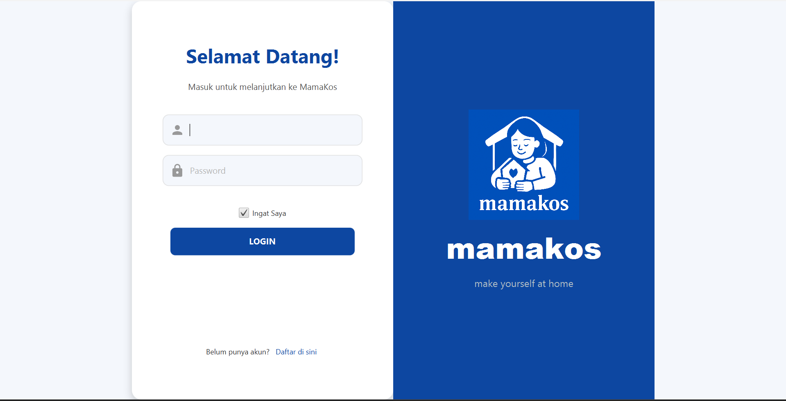
**Login dan Register**

## **Dashboard Administrator**
---

### **1. Dashboard Administrator**

Dashboard ini dirancang sebagai pusat kendali utama aplikasi. Fungsinya adalah untuk mengawasi dan mengelola data master, bukan untuk terlibat dalam transaksi sewa-menyewa sehari-hari.

* **Tampilan Utama (Dashboard Statistik):**
    * **Tujuan:** Memberikan gambaran umum (overview) tentang kondisi platform secara keseluruhan.
    * **Fitur:** Menampilkan kartu-kartu statistik kunci seperti:
        * Total Pengguna (User) yang terdaftar.
        * Total Pemilik Kos (Seller) yang terdaftar.
        * Total Kosan yang ada di platform.
        * Jumlah pesanan yang sedang aktif atau total transaksi (tergantung implementasi).

* **Manajemen Pengguna:**
    * **Tujuan:** Mengelola semua akun yang ada di sistem.
    * **Fitur:**
        * Menampilkan daftar lengkap semua pengguna (baik User maupun Seller).
        * Kemampuan untuk **menghapus akun pengguna**. Proses ini akan secara otomatis menghapus data-data terkait pengguna tersebut (misalnya, jika seorang Seller dihapus, semua kosan miliknya juga akan terhapus) untuk menjaga integritas database.

* **Manajemen Kosan:**
    * **Tujuan:** Mengelola semua properti kosan yang terdaftar di platform.
    * **Fitur:**
        * Menampilkan daftar lengkap semua kosan dari semua pemilik.
        * Kemampuan untuk **menghapus properti kosan** jika melanggar aturan atau atas permintaan khusus.

* **Sidebar Navigasi:**
    * Tombol untuk berpindah antara halaman Dashboard, Manajemen Pengguna, dan Manajemen Kosan.
    * Tombol **Log Out** untuk keluar dari akun Administrator.
      
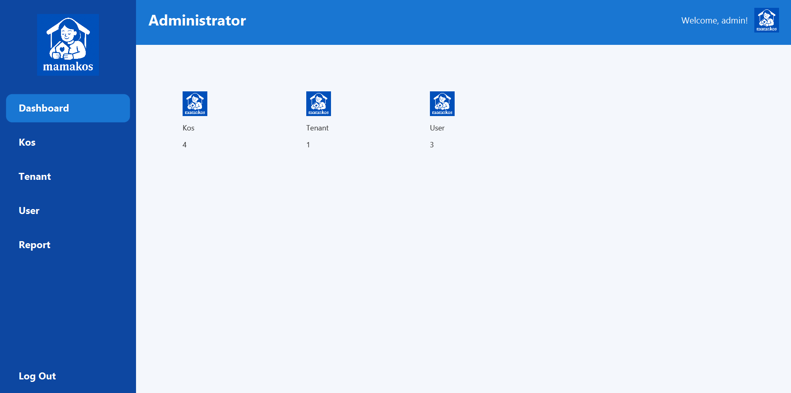
**Dashboard Administrator**

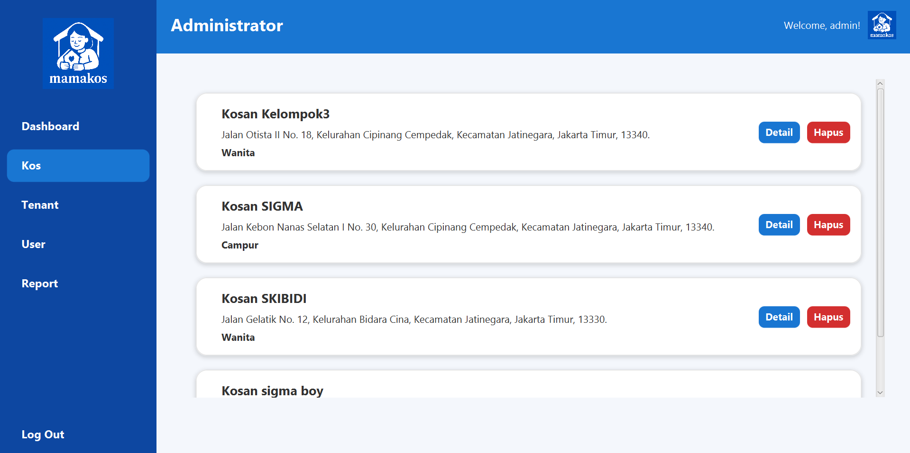
**Dashboard Administrator**

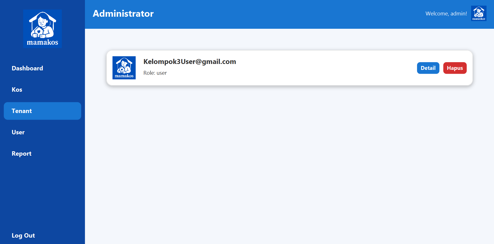
**Dashboard Administrator**

### **2. Dashboard User (Penyewa)**

Dashboard ini berfokus pada pengalaman pencarian dan pemesanan kosan. Semua fiturnya dirancang untuk memudahkan pengguna menemukan tempat tinggal yang ideal.

* **Tampilan Utama (Pencarian Kosan):**
    * **Tujuan:** Menjadi halaman utama bagi pengguna untuk menjelajahi semua kosan yang tersedia.
    * **Fitur:**
        * **Daftar Kosan:** Menampilkan semua properti kosan dalam format kartu (card view) yang menarik secara visual.
        * **Fitur Pencarian:** Sebuah kolom pencarian untuk mencari kosan berdasarkan nama atau alamat.
        * **Filter Lanjutan:** Opsi untuk menyaring kosan berdasarkan kriteria spesifik seperti:
            * Jenis Kos (Pria, Wanita, Campur).
            * Rentang Harga (Minimum dan Maksimum).
            * Lokasi terdekat dari universitas atau titik penting lainnya.

* **Halaman Detail Kosan:**
    * **Tujuan:** Memberikan informasi selengkap mungkin tentang satu properti kosan.
    * **Fitur:**
        * **Galeri Foto:** Menampilkan semua gambar yang telah diunggah oleh pemilik kos.
        * **Informasi Detail:** Deskripsi lengkap, alamat, harga, dan semua fasilitas yang tersedia.
        * **Ulasan dan Rating:** Menampilkan rating bintang dan komentar dari penyewa-penyewa sebelumnya.
        * **Tombol "Sewa Sekarang":** Tombol aksi utama yang akan memulai alur proses pemesanan.

* **Halaman Pemesanan (Order):**
    * **Tujuan:** Memformalkan proses penyewaan.
    * **Fitur:**
        * Formulir untuk memilih **tanggal mulai sewa** dan **durasi sewa** (dalam bulan).
        * Ringkasan pemesanan yang akan dibuat.
        * Tombol untuk mengirimkan permintaan sewa kepada pemilik kos.

* **Riwayat Pemesanan & Struk:**
    * **Tujuan:** Memberikan rekam jejak transaksi kepada pengguna.
    * **Fitur:**
        * Melihat daftar semua pemesanan yang pernah diajukan beserta statusnya (Pending, Approved, Rejected).
        * Kemampuan untuk melihat dan **mencetak struk digital** sebagai bukti sewa untuk pesanan yang telah disetujui (status 'approved').

---
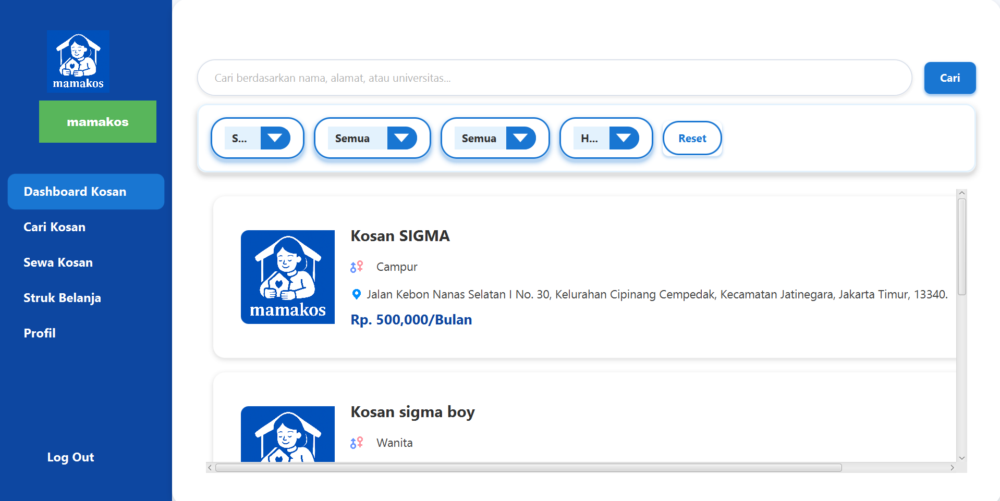
**Dashboard User**

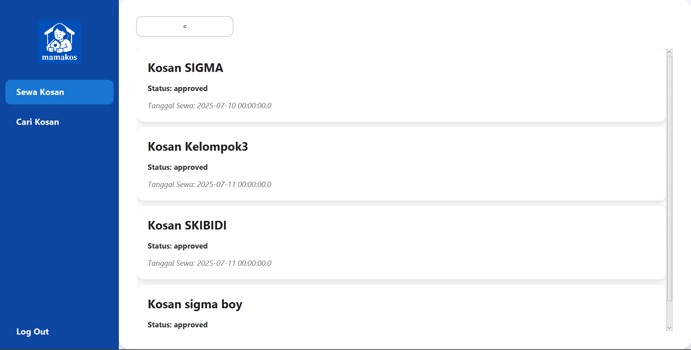
**Dashboard User**

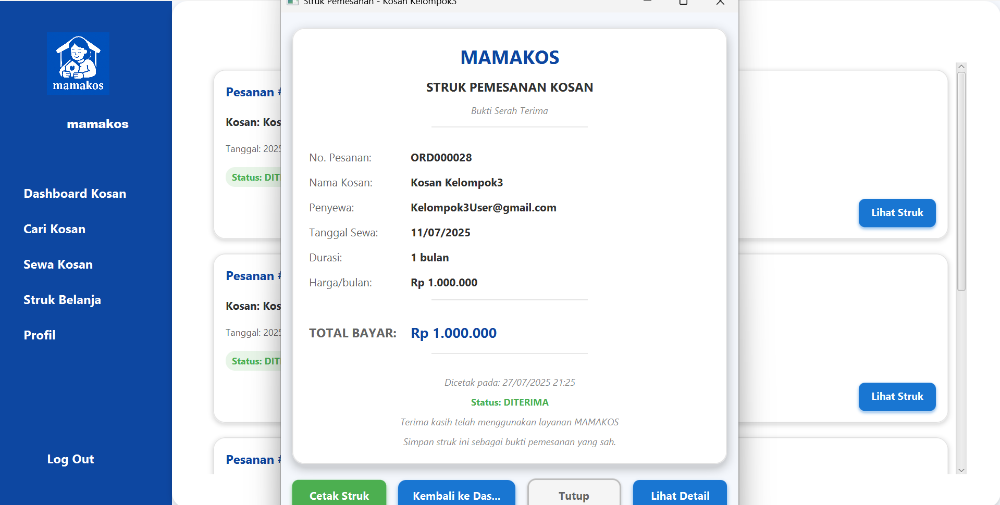
**Dashboard User**

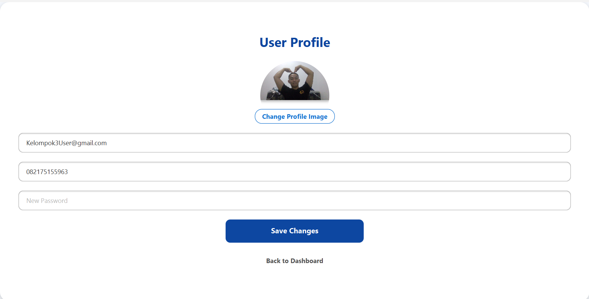
**Dashboard User**


### **3. Dashboard Seller (Pemilik Kos)**

Dashboard ini adalah alat kerja utama bagi pemilik kos untuk mengelola properti dan transaksi mereka.

* **Tampilan Utama (Dashboard Penjual):**
    * **Tujuan:** Memberikan ringkasan properti yang dimiliki dan aktivitas pesanan yang masuk.
    * **Fitur:**
        * **Daftar Kosan Milik Sendiri:** Menampilkan semua properti kosan yang telah ditambahkan oleh seller tersebut. Berbeda dari dashboard User yang menampilkan semua kosan, ini hanya menampilkan milik seller yang sedang login.
        * **Notifikasi Pesanan Masuk:** Sebuah area atau panel yang menampilkan pesanan-pesanan baru yang menunggu persetujuan.

* **Halaman Tambah Kosan:**
    * **Tujuan:** Antarmuka untuk memasukkan properti baru ke dalam sistem.
    * **Fitur:**
        * Formulir lengkap untuk mengisi nama, alamat, deskripsi, harga, dan jenis kos.
        * Opsi untuk memilih berbagai **fasilitas** yang tersedia (AC, Kamar Mandi Dalam, dll.).
        * Fitur **unggah banyak gambar** dengan pratinjau.
        * Tombol "Simpan" untuk mendaftarkan kosan ke database.

* **Halaman Manajemen Pesanan (Order Kosan):**
    * **Tujuan:** Memproses permintaan sewa yang masuk.
    * **Fitur:**
        * Menampilkan daftar detail semua pesanan yang masuk untuk properti milik seller.
        * Tombol **"Terima" (Approve)** dan **"Tolak" (Reject)** untuk setiap pesanan.
        * Ketika pesanan diterima, statusnya akan berubah menjadi `approved` dan secara otomatis data sewa akan tercatat di tabel `sewa`.

* **Sidebar Navigasi:**
    * Tombol untuk berpindah antara halaman Dashboard, Tambah Kosan, dan Order Kosan.
    * Tombol **Log Out**.
-----
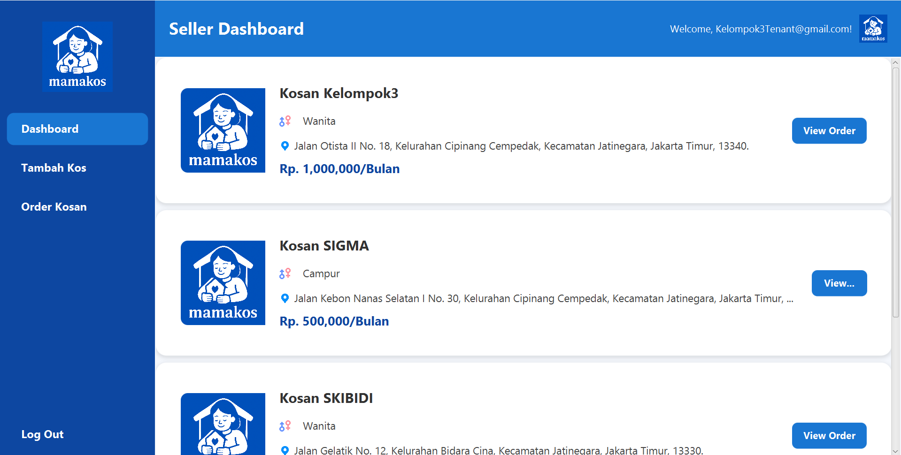
**Dashboard Seller**

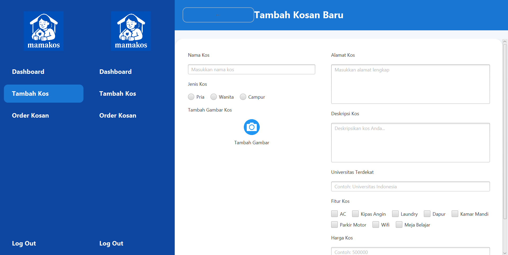
**Dashboard Seller**

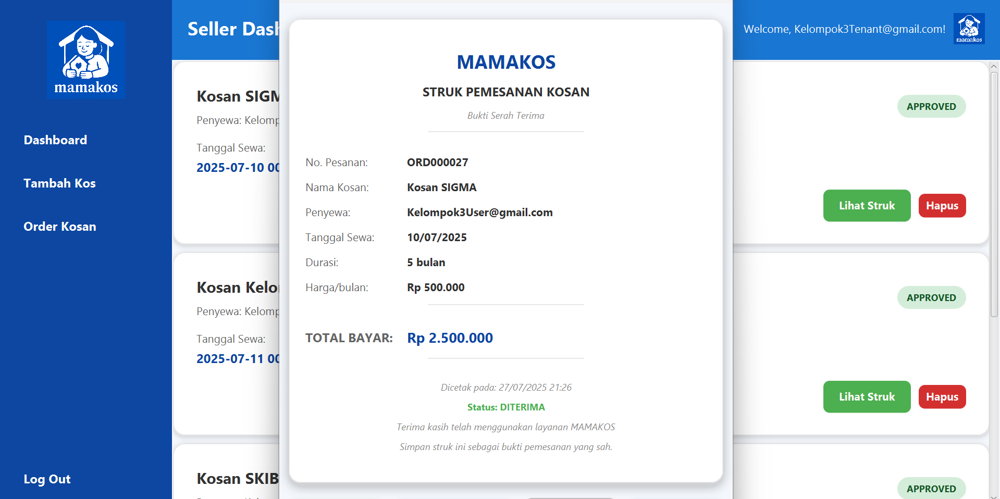
**Dashboard Seller**

# **Aplikasi Manajemen Kosan "MAMAKOS"**

[](https://opensource.org/licenses/MIT)

Repositori ini berisi kode sumber untuk **MAMAKOS**, sebuah aplikasi desktop komprehensif yang dibangun menggunakan JavaFX. Aplikasi ini berfungsi sebagai platform untuk manajemen, pencarian, dan penyewaan properti kos-kosan, yang menghubungkan tiga jenis pengguna: Administrator, Pemilik Kos (Seller), dan Penyewa (User).

## **Daftar Isi**

1.  [Tentang Aplikasi](https://www.google.com/search?q=%23-tentang-aplikasi)
2.  [Fitur Utama](https://www.google.com/search?q=%23-fitur-utama)
3.  [Teknologi yang Digunakan](https://www.google.com/search?q=%23%EF%B8%8F-teknologi-yang-digunakan)
4.  [Struktur Proyek](https://www.google.com/search?q=%23-struktur-proyek)
5.  [Skema Database](https://www.google.com/search?q=%23-skema-database)
6.  [Alur Kerja & Komponen Kunci](https://www.google.com/search?q=%23-alur-kerja--komponen-kunci)
7.  [Panduan Instalasi & Setup](https://www.google.com/search?q=%23-panduan-instalasi--setup)
8.  [Isu yang Diketahui & Potensi Peningkatan](https://www.google.com/search?q=%23-isu-yang-diketahui--potensi-peningkatan)

## **📝 Tentang Aplikasi**

MAMAKOS dirancang untuk mengatasi tantangan dalam proses pencarian dan manajemen kosan secara manual. Aplikasi ini menyediakan ekosistem digital di mana:

  * **Penyewa (User)** dapat dengan mudah menemukan kosan yang sesuai dengan kriteria mereka, melihat detail properti, dan mengajukan pemesanan secara online.
  * **Pemilik Kos (Seller)** dapat mempromosikan properti mereka, mengelola daftar kosan, dan memproses permintaan sewa yang masuk secara efisien.
  * **Administrator** dapat mengawasi seluruh aktivitas dalam sistem, mengelola data pengguna dan properti, serta memastikan platform berjalan dengan baik.

## **✨ Fitur Utama**

### **Umum**

  * **Sistem Autentikasi**: Proses registrasi dan login yang aman untuk setiap peran pengguna.
  * **Manajemen Sesi**: Menggunakan pola Singleton (`SessionManager`) untuk mengelola sesi pengguna yang sedang aktif.
  * **Antarmuka Berbasis Peran**: Tampilan dashboard dan fungsionalitas disesuaikan secara dinamis berdasarkan peran pengguna yang login.

### **Fitur untuk Penyewa (User)**

  * **Dashboard Pengguna**: Menampilkan daftar semua kosan yang tersedia dengan opsi pencarian dan penyortiran.
  * **Pencarian Lanjutan**: Filter kosan berdasarkan nama, alamat, jenis (Pria/Wanita/Campur), rentang harga, dan kedekatan dengan universitas.
  * **Tampilan Detail Kosan**: Melihat informasi lengkap properti, termasuk deskripsi, fasilitas, galeri foto, dan ulasan dari pengguna lain.
  * **Sistem Pemesanan**: Alur pemesanan yang mudah, memungkinkan pengguna untuk menentukan tanggal mulai sewa dan durasi sewa.
  * **Riwayat & Struk**: Melihat riwayat pemesanan yang telah disetujui dan mencetak struk digital sebagai bukti pembayaran.
  * **Sistem Ulasan**: Memberikan rating dan komentar pada kosan yang pernah disewa untuk membantu pengguna lain.

### **Fitur untuk Pemilik Kos (Seller)**

  * **Dashboard Penjual**: Mengelola semua properti kosan yang dimiliki dan melihat pesanan yang masuk.
  * **Manajemen Kosan (CRUD)**: Fungsionalitas untuk menambah, melihat, memperbarui (belum diimplementasikan), dan menghapus data kosan.
  * **Manajemen Pesanan**: Menerima notifikasi pesanan baru dan memiliki opsi untuk menerima (`approve`) atau menolak (`reject`) permintaan sewa.
  * **Antarmuka Tambah Kosan**: Form yang intuitif untuk menambahkan properti baru, termasuk unggah banyak gambar dan pemilihan fasilitas.

### **Fitur untuk Administrator**

  * **Dashboard Admin**: Menampilkan statistik ringkasan sistem, seperti total pengguna, penjual, dan jumlah kosan yang terdaftar.
  * **Manajemen Pengguna Penuh**: Kemampuan untuk melihat dan menghapus akun pengguna (User/Seller) dari sistem.
  * **Manajemen Kosan Penuh**: Kemampuan untuk melihat dan menghapus properti kosan mana pun yang ada di platform.
  * **Penghapusan Bertingkat (Cascading Delete)**: Proses penghapusan dirancang untuk menjaga integritas data dengan menghapus semua data terkait (pesanan, sewa, ulasan) saat sebuah kosan atau pengguna dihapus.

## **🛠️ Teknologi yang Digunakan**

  * **Bahasa Pemrograman**: Java (JDK 11+)
  * **Framework Antarmuka Pengguna (UI)**: JavaFX
  * **Database**: MariaDB / MySQL
  * **Manajemen Koneksi Database**: HikariCP (High-performance JDBC Connection Pool)
  * **Library Tambahan**:
      * **ControlsFX**: Digunakan untuk komponen UI tambahan seperti `Rating` pada form ulasan.

## **📂 Struktur Proyek**

Kode sumber diorganisir ke dalam beberapa kategori logis untuk memastikan keterbacaan dan kemudahan pemeliharaan.

  * **`Controllers`**: Mengatur logika untuk setiap file FXML.
      * `LoginController`, `RegistrasiController`: Menangani autentikasi pengguna.
      * `UserDashboardController`, `SellerDashboardController`, `AdminDashboardController`: Controller utama untuk setiap peran.
      * `OrderKosController`, `OrderCardController`: Mengelola logika pemesanan dan tampilan kartu pesanan.
      * `AddKosController`, `KosanDetailController`: Mengelola penambahan dan tampilan detail kosan.
  * **`DAO (Data Access Objects)`**: Jembatan antara aplikasi dan database.
      * `KosanDAO`, `OrderDAO`, `UserDAO` (implisit dalam controller), `UlasanDAO`: Menyediakan metode CRUD untuk setiap entitas.
  * **`Models (POJO)`**: Representasi objek dari tabel database.
      * `Kosan.java`, `User.java`, `Order.java`, `Ulasan.java`.
  * **`Services`**: Kelas fungsionalitas global.
      * `NavigationService.java`: Mengelola semua transisi antar-halaman/scene, termasuk pengiriman data.
      * `SessionManager.java`: Menyimpan state pengguna yang sedang login.
  * **`Utilities`**: Kelas pembantu.
      * `DatabaseUtil.java`: Menginisialisasi connection pool dan menyediakan koneksi ke database.
      * `PasswordUtil.java`: Menyediakan metode untuk hashing dan verifikasi password.
  * **`Launcher`**: Titik masuk aplikasi.
      * `MainLauncher.java`: Menjalankan `DatabaseSetup` sebelum meluncurkan UI JavaFX.

## **🗃️ Skema Database**

Database `data_kos` adalah inti dari aplikasi ini, dengan relasi sebagai berikut:

  * **`users`**:
      * `id_user` (INT, PK, AI): ID unik pengguna.
      * `username` (VARCHAR): Email atau username untuk login.
      * `password` (VARCHAR): Password yang sudah di-hash.
      * `role` (VARCHAR): Peran pengguna ('admin', 'seller', 'user').
  * **`kosan`**:
      * `id_kos` (INT, PK, AI): ID unik properti kosan.
      * `id_user` (INT, FK -\> users.id\_user): Menandakan siapa pemilik kosan.
      * `nama_kos`, `alamat`, `deskripsi` (TEXT).
      * `harga` (INT): Harga sewa per bulan.
      * `fitur`, `fasilitas_kamar` (TEXT): Disimpan sebagai string berformat JSON.
  * **`orders`**:
      * `id_order` (INT, PK, AI): ID unik untuk setiap permintaan pemesanan.
      * `id_kos` (INT, FK -\> kosan.id\_kos): Kosan yang dipesan.
      * `id_user` (INT, FK -\> users.id\_user): Pengguna yang memesan.
      * `durasi` (INT): Durasi sewa dalam bulan.
      * `status` (ENUM: 'pending', 'approved', 'rejected', 'paid').
  * **`sewa`**:
      * `id` (INT, PK, AI): ID unik untuk data sewa aktif.
      * `id_kos` (INT, FK -\> kosan.id\_kos).
      * `id_user` (INT, FK -\> users.id\_user).
      * `tanggal_mulai` (DATE): Tanggal dimulainya masa sewa.
  * **`ulasan`**:
      * `id_ulasan` (INT, PK, AI): ID unik ulasan.
      * `id_kos` (INT, FK -\> kosan.id\_kos).
      * `id_user` (INT, FK -\> users.id\_user).
      * `rating` (INT): Rating bintang (1-5).
      * `komentar` (TEXT).

**Relasi Kunci**:

  * Seorang `Seller` (`users` dengan role 'seller') dapat memiliki banyak `kosan`.
  * Seorang `User` dapat membuat banyak `orders`.
  * Setiap `kosan` dapat memiliki banyak `orders` dan `ulasan`.

## **⚙️ Alur Kerja & Komponen Kunci**

  * **Alur Autentikasi**:

    1.  Pengguna memasukkan kredensial di `LoginController`.
    2.  Controller memanggil `PasswordUtil.checkPassword()` untuk membandingkan hash password yang dimasukkan dengan hash di database.
    3.  Jika berhasil, data pengguna diambil dan disimpan dalam `SessionManager.getInstance().setCurrentUser()`.
    4.  `NavigationService` mengarahkan pengguna ke dashboard yang sesuai dengan perannya.

  * **Alur Pemesanan & Sewa**:

    1.  `User` menekan tombol "Sewa Sekarang" pada `KosanDetailController`.
    2.  `NavigationService` membawanya ke `OrderKosController`, sambil membawa data `Kosan` yang dipilih.
    3.  Pengguna mengisi detail sewa, dan `OrderDAO.createOrder()` dipanggil untuk membuat record baru di tabel `orders` dengan status `pending`.
    4.  `Seller` melihat pesanan ini di dashboard-nya dan menekan "Terima".
    5.  `OrderCardController` memanggil `OrderDAO.updateOrderStatusWithSewa()`. Metode ini melakukan dua hal dalam satu transaksi database:
          * Mengubah status di tabel `orders` menjadi `approved`.
          * Menyisipkan record baru ke dalam tabel `sewa`.
    6.  Status "Tersedia" atau "Tidak Tersedia" pada sebuah kosan dapat ditentukan dengan memeriksa apakah ada sewa aktif di tabel `sewa` untuk `id_kos` tersebut.

## **🚀 Panduan Instalasi & Setup**

Untuk menjalankan aplikasi ini di lingkungan lokal, ikuti langkah-langkah berikut:

1.  **Prasyarat**:

      * Java Development Kit (JDK) versi 11 atau lebih tinggi.
      * Sistem Database MariaDB atau MySQL.
      * IDE Java seperti IntelliJ IDEA atau Eclipse.

2.  **Setup Database**:

      * Buat sebuah database baru dengan nama `data_kos`.
      * Impor file `data_kos (8).sql` yang tersedia di repositori ke dalam database yang baru Anda buat. Ini akan membuat semua tabel yang diperlukan dan mengisi beberapa data awal.
      * Buat akun admin awal dengan menjalankan `AdminAccountSetup.java` jika diperlukan.

3.  **Konfigurasi Koneksi**:

      * Di dalam direktori `src/main/resources/com/example/uji_coba/`, buat file baru bernama `db.properties`.
      * Isi file tersebut dengan konfigurasi koneksi database Anda, seperti contoh di bawah ini:
        ```properties
        db.url=jdbc:mysql://localhost:3306/data_kos
        db.user=root
        db.password=
        ```
      * Sesuaikan `url`, `user`, dan `password` dengan pengaturan database lokal Anda.

4.  **Menjalankan Aplikasi**:

      * Buka proyek di IDE Anda.
      * Pastikan semua library (seperti JavaFX, ControlsFX, dan HikariCP) sudah ditambahkan ke classpath proyek.
      * Temukan dan jalankan file `MainLauncher.java`. Ini adalah titik masuk utama aplikasi.

## **⚠️ Isu yang Diketahui & Potensi Peningkatan**

Proyek ini memiliki beberapa area yang dapat ditingkatkan, terutama dari sisi keamanan dan kualitas kode.

  * **[KEAMANAN KRITIS] Password Tidak Menggunakan Salt**:

      * **Isu**: `PasswordUtil` menggunakan SHA-256 tanpa *salt*. Ini membuatnya rentan terhadap serangan *rainbow table*.
      * **Saran**: Migrasi ke algoritma hashing modern yang sudah menyertakan salt secara otomatis, seperti **BCrypt** atau **SCrypt**.

  * **[KEAMANAN KRITIS] Update Password dalam Teks Polos**:

      * **Isu**: Pada `UserProfileController`, saat pengguna mengubah password, password baru disimpan ke database tanpa di-hash terlebih dahulu.
      * **Saran**: Panggil `PasswordUtil.hashPassword()` pada password baru sebelum menyimpannya ke database.

  * **[BUG] Kalkulasi Total Harga Salah**:

      * **Isu**: `OrderCardController` menampilkan total harga dengan durasi yang di-hardcode (`1 bulan`), bukan menggunakan durasi asli dari pesanan. Ini menyebabkan informasi yang salah ditampilkan kepada penjual.
      * **Saran**: Ubah baris `int durasi = 1;` menjadi `int durasi = order.getDurasi();` di dalam metode `setData`.

  * **[INKONSISTENSI] Logika Update Status Pesanan**:

      * **Isu**: Terdapat dua metode untuk update status pesanan. `OrderCardController` menggunakan `updateOrderStatusWithSewa` (benar), sementara `SewaKosanController` menggunakan `updateOrderStatus` (salah, karena tidak membuat record di tabel `sewa`).
      * **Saran**: Hapus atau refactor `SewaKosanController` agar menggunakan metode DAO yang benar dan konsisten.

  * **[KODE LEGACY] File Redundan**:

      * **Isu**: Terdapat beberapa file yang fungsinya tumpang tindih atau sudah digantikan oleh implementasi yang lebih baik (contoh: `KosDB.java`, `SellerController.java`, `AdminController.java`).
      * **Saran**: Hapus file-file ini dari proyek untuk mengurangi kebingungan dan menyederhanakan basis kode.
